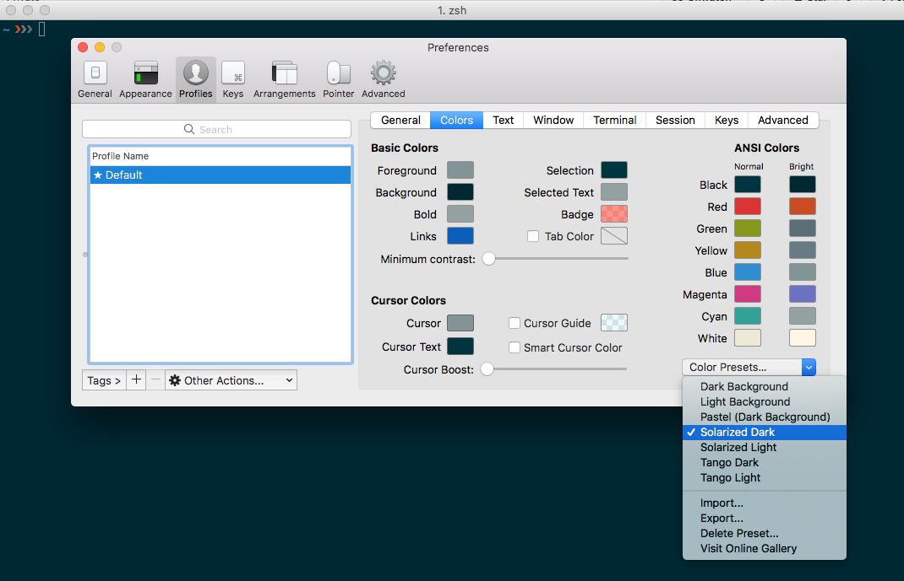
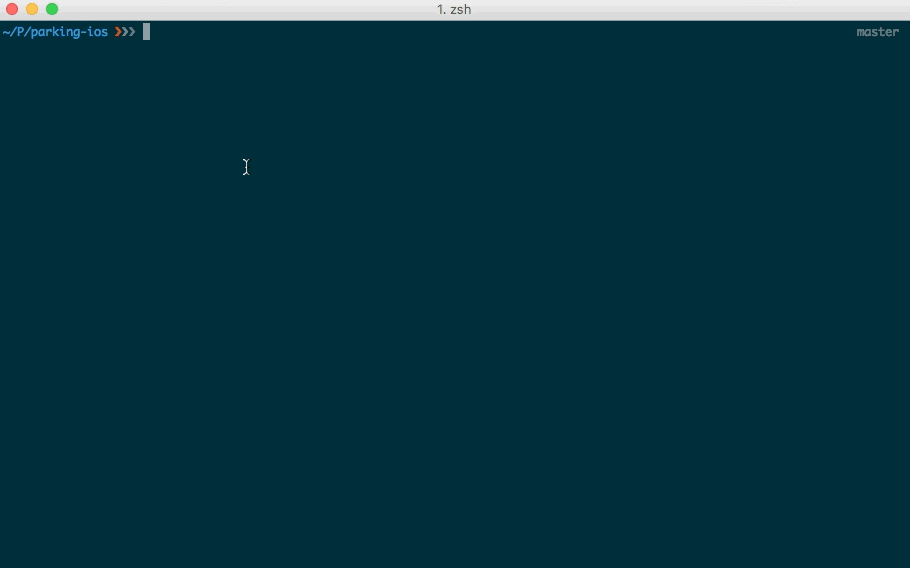

## My configuration of iTerm with ZSH + Prezto

After a long time restoring backups from previous laptops I decided to go with a fresh install which made me look for a lot of things I had already configured to my needs so I decided to write this as a cheatsheet/reminder for myself but also share it here for anyone to use it.

This is a step by step guide on how to install iTerm, PREZTO and my current config of them.

### Install iTerm and zsh
Install iTerm using [Homebrew](https://brew.sh/) 
> $ brew cask install iterm2 
Install `zsh` and `zsh-completions` using [Homebrew](https://brew.sh/) 
> $ brew install zsh zsh-completions

As a visual thing I always like to change the theme to Solarized Dark which you can do from the Preferences menu under Profiles > Color



You will start seeing some amazing features by default such as your current branch and different symbols depending if you have new or modified files.




### Install Prezto
Prezto installs on top of zsh
> $ git clone --recursive https://github.com/sorin-ionescu/prezto.git "${ZDOTDIR:-$HOME}/.zprezto"

Create a `~/.zshrc` file

```
setopt EXTENDED_GLOB
for rcfile in "${ZDOTDIR:-$HOME}"/.zprezto/runcoms/^README.md(.N); do
  ln -s "$rcfile" "${ZDOTDIR:-$HOME}/.${rcfile:t}"
done
```

### Enable modules to Prezto

Edit `~/.zpreztorc` file and add all the modules you want. It is VERY important to know that the order in which the modules are loaded matter so for example `prompt` must go last with `history-substring-search` right before it and then `syntax-highligting`.

This is how my modules piece of the file looks like:

```
# Set the Prezto modules to load (browse modules).
# The order matters.
zstyle ':prezto:load' pmodule \
  'environment' \
  'terminal' \
  'editor' \
  'history' \
  'directory' \
  'spectrum' \
  'utility' \
  'completion' \
  'git' \
  'syntax-highlighting' \
  'history-substring-search' \
  'prompt'

```

* `completion` add tabs completion for lots of commands.
* `directory` has shortcuts for fast navigation such as using `2` to show the directory stack or a numer `1 ... 9` to go immediately to that directory.
* `syntax-highlighting` highlights builtins, commands and functions in blue and show red when a command is wrong or incomplete.
* `history-substring-search` works together with `history` and allows you to do a search.


There are a lot more modules that you can enable/disable. Check the [README](https://github.com/sorin-ionescu/prezto/tree/master/modules) files of each one of them.

